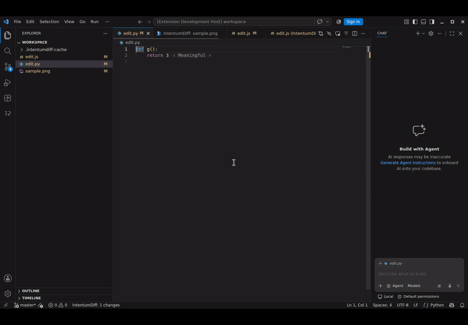
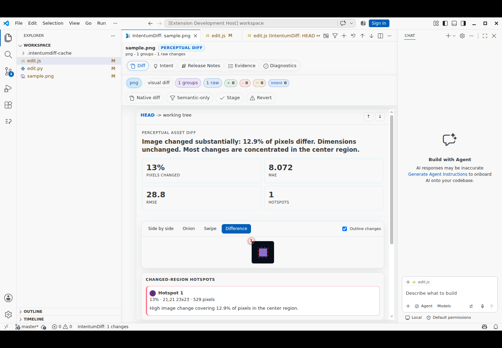

# Reviewed prerelease desktop evidence

These are actual VS Code captures from [desktop CI 35536317827](https://github.com/buchochelliq-labs/intentumdiff-vscode/actions/runs/35536317827), using synthetic test inputs with the installed VSIX and external Rust-backed CLI. They are not mockups. Tested PR head: `891bd533399d3f1e0057deca77ce70bb4a8499be`; tested merge checkout: `53ddf256d5b567fe618a01340ee3571a291e0158`. See immutable `provenance.json`, `capture-manifest.json`, and `results.json` for component identities and results.

The downloaded archive SHA256 is `48314485603d45ac8ec88df9d45b2704ccdc2d143c3e502a3f16a4c621196d72`. All 12 original capture hashes were verified again on 27 September 2026. The capture-time manifest is preserved, including its pending review status; the subsequent independent review disposition is recorded here.

Independent source and visual review approved the scoped pending/ready, incomplete-source fallback, valid-source recovery, CodeLens/native diff, and asset dark/light/high-contrast/narrow cases. The asset fixture changes 529 of 4096 pixels (12.9%) and verifies all six Rust artifact paths. The narrow case uses zoom level 2 with Explorer/Chat visible; lower content requires ordinary vertical scrolling. This is not a complete accessibility, action, viewport or release certification.

`workflow.mp4` is the original 16-second recording. The original `workflow.gif` is retained for checksum integrity but rejected for palette artifacts. `workflow-reviewed.gif` is a palette-optimized derivative, independently inspected at 1, 6 and 12 seconds. `derived-media.json` records both hashes and the exact conversion filter. No product pixels were otherwise edited.

Loading and asset layout fixes address #24/#25; this provides candidate media for #22 and prepublication evidence for #48. Marketplace publication and post-publication verification remain outstanding. No merge, tag or release is represented by this evidence commit.
